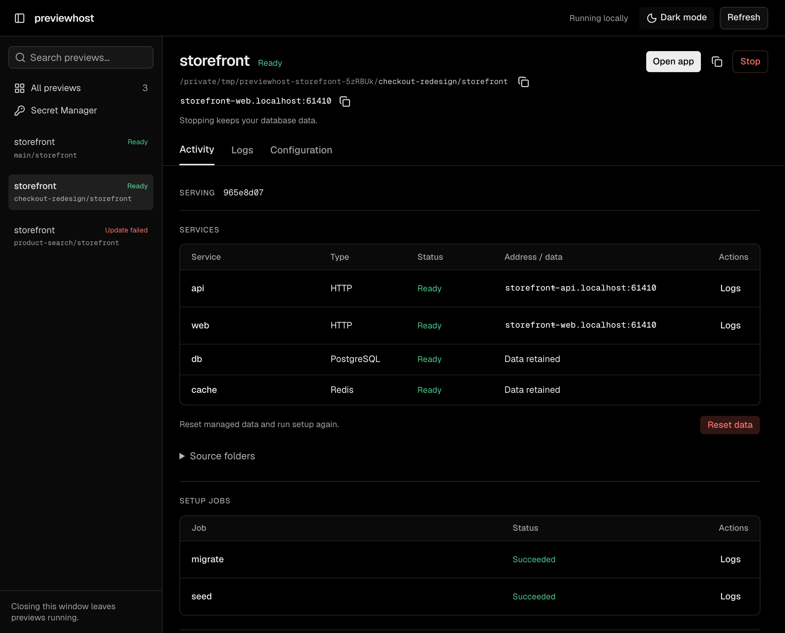

<p align="center">
  
</p>

<h1 align="center">previewhost</h1>
  <p align="center">
    <a href="https://www.npmjs.com/package/previewhost">
      
    </a>
  </p>
previewhost runs local preview environments for applications with multiple services.
An environment can connect frontends, backends, and PostgreSQL or Redis databases across repositories and Git worktrees.

Use previewhost when several coding agents or worktrees need separate running copies of the same application.
Each task gets its own service ports and connections, without manual port assignments or changes to service URLs.

Define services, commands, and connections in optional root `preview.yml`, or supply a spec directly through MCP or JSON stdin.
previewhost runs setup jobs, then starts dependent services and waits for readiness.
Use explicit [migration and seed jobs](docs/jobs.md) instead of embedding setup in server commands.

When you replace a preview, its local URL stays the same.
New requests switch to the replacement services only after they pass readiness checks.



Control environments through the CLI, MCP tools, or an embedded Node.js library:

- [CLI](#use-the-cli): control previews from a terminal or script.
- [MCP](#use-mcp): give an agent tools to control previews.
- [Library](#embed-the-library): manage previews inside your Node.js application.
- [Dashboard](#manage-local-previews): review worktrees, open apps, inspect failures, and stop or restart previews.
- [Optional agent skill](#use-the-agent-skill): give an agent instructions and recipe references for the CLI or MCP.

## Install

Previewhost supports macOS and requires Node.js 22.23 or later.
Development servers require the macOS `ps` and `lsof` tools.
Stored secrets and managed databases require macOS 13 or later.
Linux and Windows remain unverified.

For CLI and MCP use, install the package globally:

```sh
npm install -g previewhost
```

The npm package requires no native build tools.

The npm package includes the maintained agent skill and its referenced guides under `dist/skills/previewhost`.
The public npm package does not require GitHub access.

## Create a frontend and backend

Create a directory for the two Node.js servers:

```sh
mkdir previewhost-demo
cd previewhost-demo
```

<details>
<summary>Create the two server files</summary>

Save this code as `backend.mjs`:

```js
import { createServer } from 'node:http';

createServer((request, response) => {
  if (request.url !== '/message') { response.writeHead(404).end(); return; }
  response.writeHead(200, { 'content-type': 'application/json' });
  response.end(JSON.stringify({ message: 'Hello from the backend.' }));
}).listen(Number(process.env.PORT), process.env.HOST);
```

Save this code as `frontend.mjs`:

```js
import { createServer } from 'node:http';

const page = `<!doctype html>
<meta charset="utf-8">
<meta name="viewport" content="width=device-width, initial-scale=1">
<title>previewhost demo</title>
<h1>Frontend + backend</h1>
<p id="message" role="status">Connecting…</p>
<script type="module">
  const message = document.querySelector('#message');
  try {
    const response = await fetch('/message');
    if (!response.ok) throw new Error('Backend unavailable');
    message.textContent = (await response.json()).message;
  } catch {
    message.textContent = 'Backend request failed.';
  }
</script>`;

createServer(async (request, response) => {
  if (request.url === '/message') {
    try {
      const reply = await fetch(new URL('/message', process.env.BACKEND_URL), {
        signal: AbortSignal.timeout(2000),
      });
      response.writeHead(reply.status, { 'content-type': 'application/json', 'cache-control': 'no-store' });
      response.end(await reply.text());
    } catch {
      response.writeHead(503).end('Backend unavailable');
    }
  } else if (request.url === '/') {
    response.writeHead(200, { 'content-type': 'text/html' });
    response.end(page);
  } else response.writeHead(404).end();
}).listen(Number(process.env.PORT), process.env.HOST);
```

</details>

Save this recipe as `preview.yml` beside those files:

```yaml
name: hello
type: environment
primary: frontend
services:
  backend:
    type: command
    cwd: .
    command: [node, backend.mjs]
    readyPath: /message
  frontend:
    type: command
    cwd: .
    command: [node, frontend.mjs]
    readyPath: /message
    env:
      BACKEND_URL: {service: backend}
```

`primary` selects the service at the environment URL.
`BACKEND_URL` receives the backend URL through the `service` binding.
previewhost starts the frontend after the backend is ready.
Both servers use the `PORT` and `HOST` values from previewhost.
Paths resolve relative to the recipe file.

### Install locally

For library imports or a project-specific CLI, install the package in `previewhost-demo`:

```sh
npm install previewhost
```

For a local CLI installation, use `./node_modules/.bin/previewhost` in place of `previewhost` in the commands below.

### Project owners

CLI automatically selects the current Git worktree root. MCP tools select the project supplied with each call.
Both interfaces find or start the same persistent project owner.
Outside Git, the current directory is the project. Use `--project /absolute/project` to choose it explicitly.
An owner survives client disconnection and ordinary inactivity. Explicit shutdown stops all its previews.

`--allow-exec` permits trusted commands, managed database operations, private secret setup, and explicit data deletion/recovery.
It runs code with your user permissions and provides no sandbox. It selects no secrets by itself.
Supply it in the current CLI invocation or MCP registration when cold startup needs that authority.
A living owner's permissions are reused; incompatible explicit launch options produce an error.

Manual `previewhost serve` remains available. To use it, pass `--endpoint` or `--token-file` explicitly to clients.
That mode connects only and never starts or reconfigures an owner.
See [connection configuration](docs/api.md#cli).

## Manage local previews

After you start a preview through the CLI or MCP, open another terminal and run:

```sh
previewhost dashboard
```

The command opens the dashboard in your default browser. No account or separate server setup is required.
Keep this terminal open. Closing the page or stopping the dashboard does not stop your applications.
Use the theme button in the navbar to switch between light and dark mode.
Private secret forms use the same design and theme control. Browser preferences are saved separately for each local address.

Each worktree has its own preview, service connections, and managed database data.
The sidebar puts active previews first. Search by name or path, or filter by status.
Each row’s menu lets you stop, start, or clear an entry without opening its details.
Open a preview to switch between **Activity**, **Logs**, and **Configuration** at the top.
Activity shows services, setup jobs, and recovery actions. Logs and Configuration have their own scrollable views.
In **Logs**, choose an attempt and source, then search its captured output. Search ignores letter case; **Clear** or Escape restores all captured lines.


| What you need | Dashboard control |
| --- | --- |
| Open the right worktree | Check its source path, then select **Open app**. |
| Diagnose a failed update | Compare **Serving** with **Latest update**, then open the failed job's **Logs** or select an attempt in **Logs**. |
| Cancel an unfinished update | Select **Cancel update**. The previous application keeps running. |
| Stop work without losing database data | Select **Stop**. Use **Start preview** to run the same configuration again. |
| Test with fresh managed data | From the preview’s menu, select **Reset data**. Confirm the databases; setup runs again. |
| Delete data without restarting | Stop the preview, then select **Delete data** from its menu. Deletion cannot be undone. |
| Clear an old entry | Select **Remove entry** after stopping it and deleting any retained data. Source files and saved secrets remain. |
| Reuse an agent's configuration | Open **Configuration**, then **Save as preview.yml**. Existing files are never overwritten. |
| Change a stored secret | Open **Secret Manager**, find its reference, then select **Edit**. Enter the replacement in the dialog and save. |
| Supply a missing secret | Select **Open private form** to approve access and enter values outside the chat. |

A failed replacement leaves the previous application available. **Open app** still points to that serving attempt.

<details>
<summary>Inspect a failed update and its logs</summary>


Select a job's **Logs** to open its output.


</details>

**Start preview** uses the retained configuration and current source. It does not reload `preview.yml`, and its URL can change.
After you fix an initial startup failure, **Retry start** reruns that attempt.
Saving a recipe does not change the running preview. Stored secret values are not included in the dashboard's configuration view.
If your agent ends its turn before private setup finishes, send it a short continuation message after saving.
Canceled private requests stay canceled.

Secret Manager lists reference names, never values. Updating a shared reference affects future starts in every project that uses it. Running apps and access approvals stay unchanged.

The dashboard lists automatic project owners and data retained after clean owner shutdown.
Deleted worktrees remain manageable. Unreachable owners require cleanup verification before removal.
Standalone `serve` instances and embedded library runtimes are not automatically listed.
It does not start owners or grant execution permissions. Removing the last entry closes an empty owner and ends its private approvals.
Use your editor or the CLI/MCP to edit configuration or shut down an owner.
See [dashboard operations](docs/api.md#local-dashboard-operations) for lifecycle and permission details.

## Use the CLI

From the demo directory, start the example:

```sh
previewhost start --allow-exec
```

The command loads root `preview.yml`, starts its owner, and waits for readiness. It returns `state: "ready"` and a `url`, or `starting` if the wait budget expires. Continue waiting for that attempt when needed.
Open that URL in a browser. The page shows **Frontend + backend**, then **Hello from the backend.**
The frontend forwards the browser's `/message` request to the backend.

Read the current status:

```sh
previewhost get hello
```

Stop the preview after use:

```sh
previewhost stop hello
```

When you finish, stop the daemon:

```sh
previewhost shutdown
```

## Use MCP

Register Previewhost once so your agent can run and manage local applications across projects and worktrees.

[Install Previewhost globally](#install), then choose your client. No repository paths or root lists are needed.

### Codex

Run in your terminal:

```sh
codex mcp add previewhost -- previewhost mcp --allow-exec
```

### Cursor

Add Previewhost to `~/.cursor/mcp.json` without removing other servers:

```json
{
  "mcpServers": {
    "previewhost": {
      "command": "previewhost",
      "args": ["mcp", "--allow-exec"]
    }
  }
}
```

Enable Previewhost in Cursor’s MCP settings.

### Claude Code

Run in your terminal:

```sh
claude mcp add --scope user previewhost -- previewhost mcp --allow-exec
```

### Preview your application

Ask the agent in your project chat:

```text
Change this button and preview the application with Previewhost.
```

- **Execution:** `--allow-exec` permits trusted application commands, managed database operations, and private secret setup as your local user.
- **Databases:** Managed PostgreSQL or Redis requires a running local Docker Engine and database images. Docker Desktop uses its default socket. [Other Engines need a socket override](docs/api.md#managed-databases-with-mcp).
- **Approvals:** Approve project and backend access in your client. Approve secret names and enter missing values only in the private browser form. Your client can also require individual tool approvals. MCP reconnection requires project approval again; existing previews keep running.

`preview.yml` is optional. The agent reuses it when present and reports invalid YAML. Configuration is saved only when you ask.

Open the dashboard to compare previews, inspect configuration and errors, or stop and restart an environment:

```sh
previewhost dashboard
```

See [advanced configuration](docs/api.md#http-and-mcp), [troubleshooting](docs/troubleshooting.md), and [tested clients and limitations](docs/integrations.md#september-15-global-onboarding-check).
The [agent skill](#use-the-agent-skill) is optional and installed separately from MCP registration.

## Embed the library

The library runs previews within your Node.js application and requires no separate daemon.
Use the [example files](#create-a-frontend-and-backend) and [local package installation](#install-locally).

Save this code as `preview.mjs` in `previewhost-demo`:

```js
import { createPreviewRuntime, loadPreviewSpec } from 'previewhost';

const spec = await loadPreviewSpec('preview.yml');
const runtime = await createPreviewRuntime({
  allowedRoots: [process.cwd()],
  authorize: ({ operation }) => operation === 'start',
});
try {
  const started = await runtime.start(spec);
  const result = await runtime.wait(spec.name, started.candidate.id);
  if (result.state !== 'ready') throw new Error(result.error?.message ?? result.state);
  console.log(result.url);
  console.log(await (await fetch(new URL('/message', result.url))).json());
} finally {
  await runtime.close();
}
```

Run the example:

```sh
node preview.mjs
```

The script prints the URL and backend response, then stops both servers and closes the runtime.
For a persistent preview, keep the runtime open until your application shuts down.
See the [library reference](docs/api.md#runtime-and-client) for configuration and lifecycle methods.

## Use the agent skill

The optional skill provides instructions and recipe references for agents that use the CLI or MCP.
The installed package contains `dist/skills/previewhost/SKILL.md` and its references. An agent can read them directly.
Skill discovery installation is optional; no install hook changes client configuration.
Use the skill with an installed [CLI](#install) or a configured [MCP client](#use-mcp).

With repository access, run this command from your application directory:

```sh
npx skills add RojhatToptamus/previewhost --skill previewhost --agent codex --yes
```

This command installs from the default branch, `main`, into `.agents/skills/previewhost` in the current project.
Repeat the command to update the skill and its references.

Start a Codex session in the intended project. The skill uses the installed CLI or configured MCP connection.
Ask:

```text
$previewhost Start the preview in preview.yml. Verify the backend message in the page, then stop the preview.
```

If the application has no recipe, the agent can supply a spec directly. Ask explicitly to save `preview.yml` when you want reusable configuration.
See [agent support](docs/integrations.md#agent-skill) for discovery and tested workflows.

## Preview an application

Install the application's dependencies before startup.
Use each application's existing start command in its recipe.
See [framework configuration](docs/integrations.md#framework-configuration) for Vite, Next.js, and Python examples.

For a frontend, two backends, PostgreSQL, and Redis, use the [full-stack walkthrough](examples/multi-repo/README.md).
It covers setup, service connections, browser verification, replacement, retained data, cleanup, and adaptation to multiple repositories.
For applications in Git worktrees, see the [worktree guide](docs/worktrees.md).
The [security guide](docs/security.md) covers execution, stored secrets, and data ownership.
The [troubleshooting guide](docs/troubleshooting.md) covers connection and cleanup errors.

## Handle secrets

Recipes can reference selected environment variables and secrets stored in macOS Keychain.
The private browser form first approves access to unselected names for this owner lifetime, then collects missing values.
The same exact name shares one Keychain value across worktrees that approve it; use a distinct name for a different value.
Keep their values out of recipes and agent chat.
previewhost does not automatically load `.env` files.
See the [secrets guide](docs/api.md#stored-secrets) for setup.

## Build from source

See [Build and install a tarball](CONTRIBUTING.md#build-and-install-a-tarball) for build requirements and source installation.

## License

previewhost uses the MIT license. See [LICENSE](LICENSE) and [NOTICE](NOTICE).
