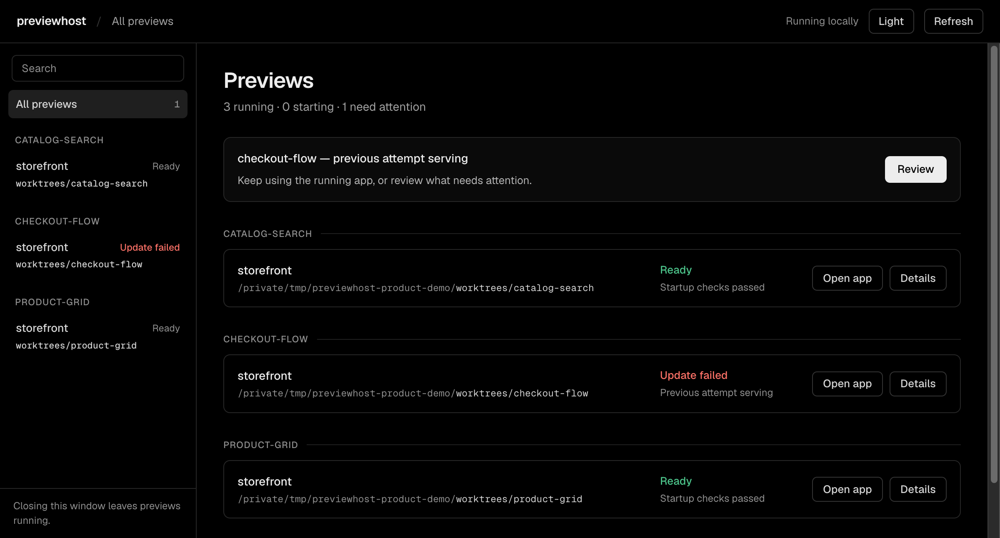
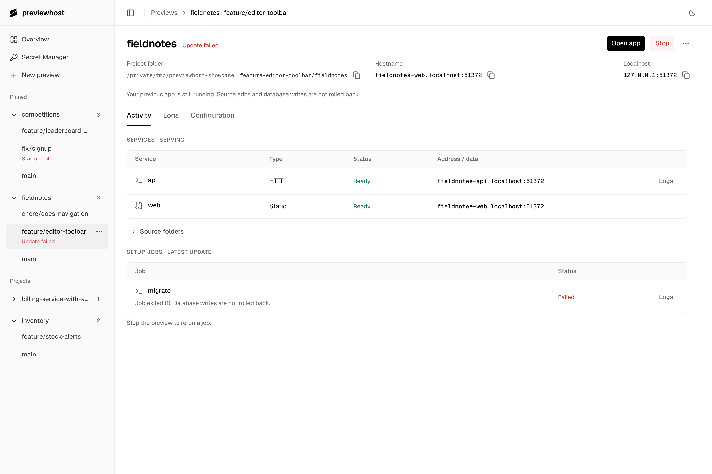
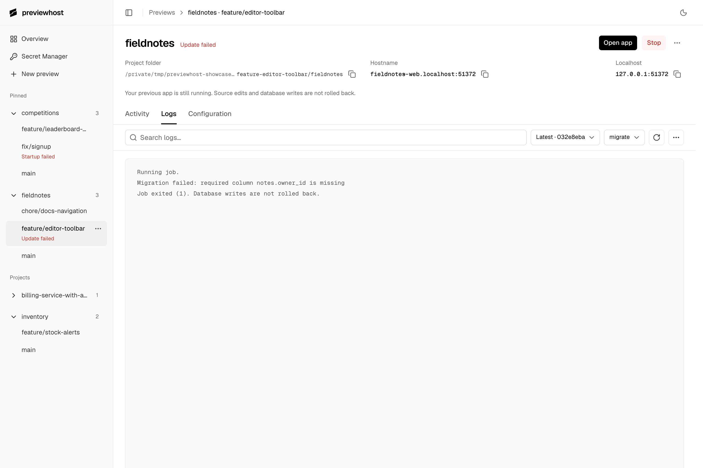

# Dashboard

Start local applications, edit environment bindings, and inspect their progress and logs.

## Open the dashboard

Run:

```sh
previewhost dashboard
```

The command opens your default browser. Keep its terminal running while you use the dashboard.
Closing the page or stopping this command does not stop your previews.

The dashboard lists automatic project owners and data retained after clean owner shutdown. Deleted worktrees can still have retained data. Standalone `serve` instances and embedded runtimes do not appear automatically.
Discovery does not start anything. **New preview** can start a project after you review its configuration and approve access.

## Start a preview

Choose **New preview**, then a known project, a registered Git worktree, or an absolute folder path.
Selecting a folder does not move an existing preview or share its database data.

Use its existing configuration file, or enter YAML/JSON without creating a file.
Default lookup accepts `preview.yaml` or `preview.yml`; invalid or conflicting files require correction.
Relative source paths resolve from the file's directory, or the selected project for pasted input.
Use **Configuration guide** for examples, or optionally copy a prompt for an agent to inspect your project.
An agent is not required. Review source folders, commands, jobs, and managed databases before allowing startup.

Private setup handles secret approval, missing values, and owner unlock. After completion, return
and continue startup. Cancellation requires an explicit new request; it never starts the application.
Closing a review does not cancel an open private form. Return to **Continue setup** on the preview,
or the unfinished reviews in **New preview**, to check setup and explicitly start the application.
Refresh does not discard a reviewed configuration. Multiple reviews stay separate.

Reviews remain available for 30 minutes after your last review or change, with at most 16 retained.
Configuration stays in the dashboard process, not browser storage. When it exits or a review expires,
choose the file or paste configuration again. Saved secrets remain.
If you close the browser tab, restore the closed tab. A new
`previewhost dashboard` process cannot recover an old process’s unfinished reviews.

Existing owners keep their execution permissions. The dashboard does not restart an owner to
change those permissions. If it was started without execution permission, explicitly shut it down
and relaunch with `--allow-exec`. This stops that owner's previews; managed data and stored values remain.

## Find the right preview



**Overview** groups linked Git worktrees under their repository. Branch names open preview
details; **Open app** opens the serving application, even if a later update failed.
Preview details show its hostname and numeric localhost URL when available, with open
and copy actions. They are different browser origins; switching does not bypass CORS.
Search by branch, folder, preview name, or source path. Filter for active work or failures.

The sidebar keeps projects in alphabetical order. Expand a project to browse its worktrees;
one project opens at a time. Its heading stays visible as you scroll. Opening a preview reveals
its selected row. Each preview has its own actions, and status changes do not reorder navigation.

Use the counts above Overview to show active previews or those needing attention. These
shortcuts clear search; the status dropdown keeps it. Overview filters do not hide the sidebar.
Separate clones and non-Git folders stay separate. Matching names show a distinguishing path.
When Git metadata is unavailable, folder labels remain usable. Branch labels reflect current
source; a preview spanning repositories stays under its owner's project.

The list fills as project checks finish. Refresh checks the selected project before the rest.
Browser Back returns to the previous view. Each preview keeps its diagnostic selections
for this browser session, including after reload. Runtime information is fetched again.

## Inspect services and updates

Open a preview's **Activity** tab to see services, setup jobs, and available recovery actions.
**Serving** identifies the active application. **Latest update** identifies the replacement attempt.
Services and setup jobs identify the attempt they belong to. A failed resource's **Logs** action
selects that exact attempt and source. Failed updates do not roll back source edits or database writes.
Waiting resources name their unfinished dependencies. Managed databases show Starting while being prepared.



| What you need | Action and consequence |
| --- | --- |
| Diagnose a failure | Open the failed job's **Logs**, or choose its attempt in the Logs tab. |
| Abandon a pending update | **Cancel update** leaves the previous application running. |
| Stop the preview | **Stop** ends owned processes and retains managed data. |
| Start after stop or cancellation | **Start preview** uses retained configuration and current source. Its URL can change. |
| Retry a failed initial start | **Retry start** reruns that attempt after you fix its cause. |
| Start with fresh managed data | In the preview menu, **Reset data** names the databases before confirmation, then starts the preview again. |
| Delete data without restarting | After stop, **Delete data** removes the selected managed databases. Deletion cannot be undone. |
| Clear an old entry | **Remove entry** requires no remaining work, managed data, or incomplete cleanup. Sources and saved secrets remain. |
| Check an unavailable owner | **Recheck status** retries the connection. **Remove entry** explains blockers and requires confirmation that application processes stopped. |

Start and retry use retained configuration. To load file changes, open **Configuration** and choose **Review and apply**, or use CLI/MCP start/replace.
Retry start does not open private setup. Complete any required secret approval and owner unlock before retrying.
Removing the last entry closes an empty automatic owner and ends its secret approvals.
Offline entries contain no restart configuration. Use **New preview** with a file or direct configuration, or start through CLI/MCP.
See [setup jobs](jobs.md#progress-and-recovery) for explicit reruns and reset behavior.

Reset and deletion results stay in the confirmation dialog. Reset reports deletion separately
from startup: a failed migration does not repeat deletion. Fix the cause, then retry startup.
If the response is lost, recheck status before taking another action.

## Read logs



Choose the attempt before comparing output. A failed replacement and a serving app have separate logs.
Then select a service or job, or use **All output**.
Logs are bounded tails, not a permanent archive.

The header's **Refresh** retrieves current logs and environment status. Search, source, attempt,
and scroll position remain selected; logs do not update automatically.
The **Log options** menu offers line wrapping and surrounding lines for search matches.
Its **Clear view** action hides output through the current cursor in this view only. Refresh shows newer output.
**Show earlier logs** restores what is still retained. Changing attempts opens that attempt normally.
Other windows, agents, and the stored log buffer are unchanged.

## Save configuration and manage secrets

**Current configuration** opens the exact input file when the attempt records one; otherwise it
opens the retained direct configuration. **Recorded attempt** remains a read-only historical view.
When a replacement fails, **Failed update configuration** opens its input file or retained declaration for correction.
**Project configuration file** explicitly selects an existing root file when it differs from that attempt.

Select a command service or setup job to add, edit, or remove a binding. Literal values remain
undisclosed; replacing one requires an explicit new value. Secret bindings contain reference
names, not credentials. Use an exact existing name only for intentional sharing.

- **Save file** updates the selected file without changing the running application. Unedited
  values, comments, and relative paths remain. Formatting can change. Concurrent changes are rejected.
- **Review and apply** starts or replaces the whole environment after review. For file-backed edits,
  save first. A saved file remains saved if application startup fails or is canceled.
- Direct configuration can be applied without writing a file. **Save as preview.yaml** is optional
  and refuses to overwrite either default file.

Replacement keeps the old app serving until the new attempt is ready. It does not roll back
source edits, migrations, or partial database writes. Successful once-only jobs stay completed;
changing their bindings does not rerun them. Use the existing explicit job rerun when needed.

Removing a binding keeps its stored secret and existing owner approval. Changing a stored value
affects future starts that use that exact reference, including other projects; it does not restart them.

**Secret Manager** creates or unlocks the dashboard’s keystore session, then lists references for editing.
Search covers all stored reference names. Use **Next** and **Previous** to browse bounded pages.
Its **Keystore options** menu offers automatic unlock controls on macOS. Project owners unlock separately through private setup.
**Open private form** handles missing values and access approval.
**Private setup** shows pending forms or the latest request result.
Completing setup does not start the app.
See [Secrets](secrets.md) before changing a value shared across projects.
