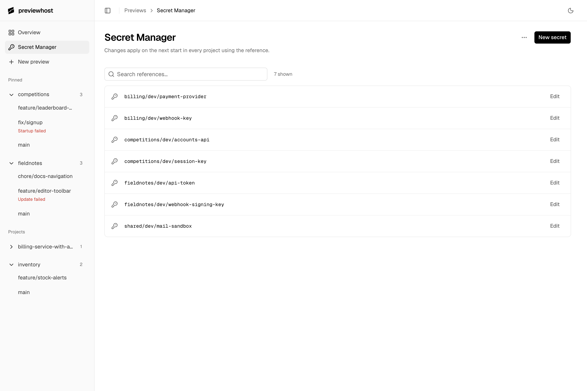

# Secrets

Store API keys and passwords outside preview.yaml. Approve access and enter secret values in a private browser form.

## Declare references

In a command service, bind the application's variable to a stored reference:

```yaml
env:
  API_TOKEN: {secret: "shop/dev/api-token"}
```

`API_TOKEN` is the application variable. `shop/dev/api-token` identifies the stored value.
The same exact reference shares one value across every project and worktree that approves it.
Use a different reference for a different value. Preserve existing references unless you intend to change the binding.

`--allow-exec` permits execution but does not select secrets or unlock the keystore.
Managed databases also need an unlocked keystore for their generated credentials, even without user-secret references.

## Approve and enter values

From the project with root `preview.yaml`, run:

```sh
previewhost secrets setup --allow-exec
```

For a different file, add `--file PATH`. MCP uses `preview_secrets_setup` with the project and its file or spec.

In the private form:

1. Approve the intended reference names and recipients.
2. Create or unlock the keystore. A new password needs at least 12 characters and matching confirmation.
3. Enter any missing values. Existing values are reused.

Keep the password for recovery. Previewhost cannot recover a lost password.
Each project owner keeps its own unlocked session and access approvals until shutdown.
Unlocking the dashboard does not unlock an owner or approve secret references.

After saving, use the request ID from setup:

```sh
previewhost secrets status REQUEST_ID --timeout-ms 25000
```

Replace `REQUEST_ID` with the actual ID. A `complete` result means setup finished, not that an application started.
Read the current configuration and preview status before starting or replacing the preview.
If the agent turn ended, send it “Secrets saved. Continue.”

If setup is `pending` or `saving`, keep the same request ID.
If you cancel the form, that request stays canceled. Partial saves retain completed writes.
Use the [recovery guide](troubleshooting.md#stored-secrets-are-missing-or-inaccessible) for expired forms or access errors.

## Change a stored value



In the dashboard's **Secret Manager**, create or unlock its session, then find the reference and select **Edit**.
The list shows names, never stored values. Saving changes future starts in all projects that use that reference.
Running applications keep the value they already received.
Search covers all stored references. Use **Next** and **Previous** to browse pages of up to 128 names.

If the keystore does not exist, create it from a terminal:

```sh
previewhost secrets init
```

Then enter the credential and list the stored names:

```sh
previewhost secrets set shop/dev/api-token
previewhost secrets list
```

To filter names, add `--query TEXT`. If the result includes `next`, pass that reference as `--after REFERENCE` with the same query.
Pages reflect current storage. Refresh from the first page to include new names that sort before the current page.

Each command requests hidden password input when its session is locked. `set` then requests the secret value through hidden input.
These commands do not grant an owner access to the reference.
Keep passwords and secret values out of command arguments, configuration files, and agent chats.

## Choose automatic unlock

On macOS, **Remember unlock on this Mac** stores an unlock key in Keychain for future sessions.
The CLI offers the same choice:

```sh
previewhost secrets remember
```

To remove automatic unlock, run:

```sh
previewhost secrets forget
```

Forget affects future sessions. Already unlocked owners and dashboards remain unlocked until shutdown.
Keep the password even with automatic unlock. On Linux and Windows, use password input.
Unattended previews can use explicitly selected `--env NAME` inputs with `{fromEnv: NAME}` instead of stored secrets.

## Storage and recovery

The keystore stores encrypted user secrets and managed database credentials at `~/.local/share/previewhost/keystore/secrets.sqlite`.
It uses AES-256-GCM encryption and a password-derived key. The optional Keychain item contains only the unlock key.
For backups, stop Previewhost and copy the complete keystore and retained-data directories. Back up database contents separately.
See [recovery instructions](troubleshooting.md#stored-secrets-are-missing-or-inaccessible) before restoring or replacing storage.
Earlier installations need the [reset procedure](../README.md#reset-required-for-earlier-installations).

Only declared recipients receive a resolved value. Previewhost hides values from status and uses best-effort log redaction.
Application code can still expose credentials through files, transformed output, or HTTP responses.
Private entry does not protect secrets from hostile code with your user permissions.

For explicit launch selections, stdin entry, deletion, and size limits, see the [secret reference](api.md#stored-secrets).
